# Mobile Based Heuristic Healthcare Maintenance with Online E-Prescribing

It is an simple online based prescription a.k.a. E-Prescription issuing application for doctors to patients built on Java and PHP.

## Description

E-prescribing, or electronic prescribing is an
emerging technology framework that allows doctors and
other medical practitioners to write and send prescriptions
to a participating pharmacy and patients electronically
instead of using handwritten prescriptions. Mobile Health
care is the maintenance or improvement of health via use
of mobile phones in medical care. In this project we make
use of health care maintenance with the help of eprescribing by use of mobile application to educate patients
about preventive health care services which includes health
tips, check for symptoms, music therapy, setting
notification remainders in mobile application.

## Getting Started

GS

### Installing

* Android Application can be run via Android Studio.
* Web App should be run in Apache Server with mysql(using XAMPP, WAMP etc)

### Screens
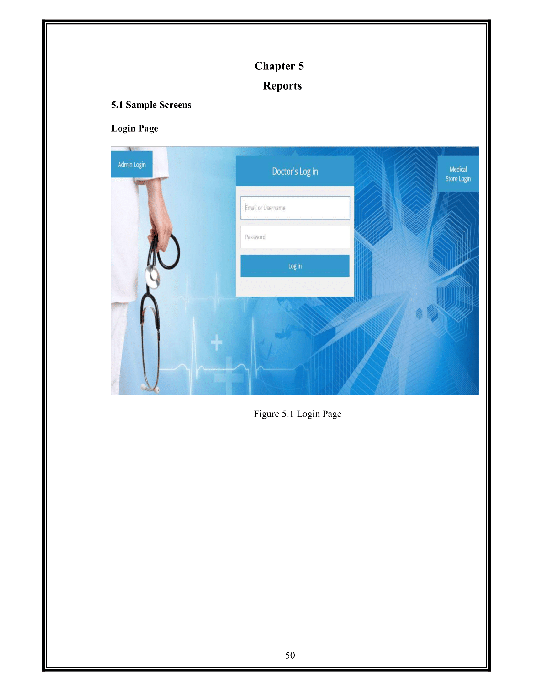
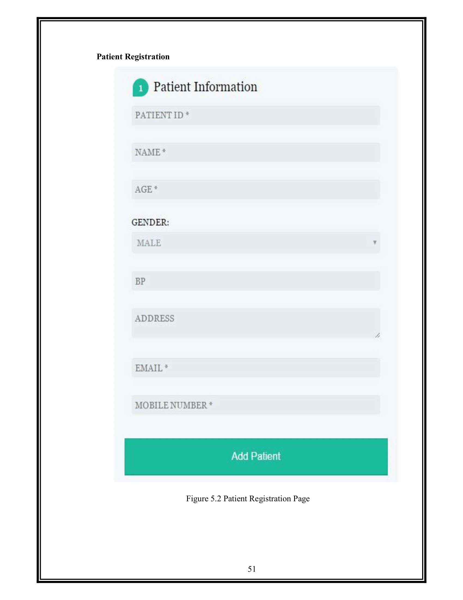
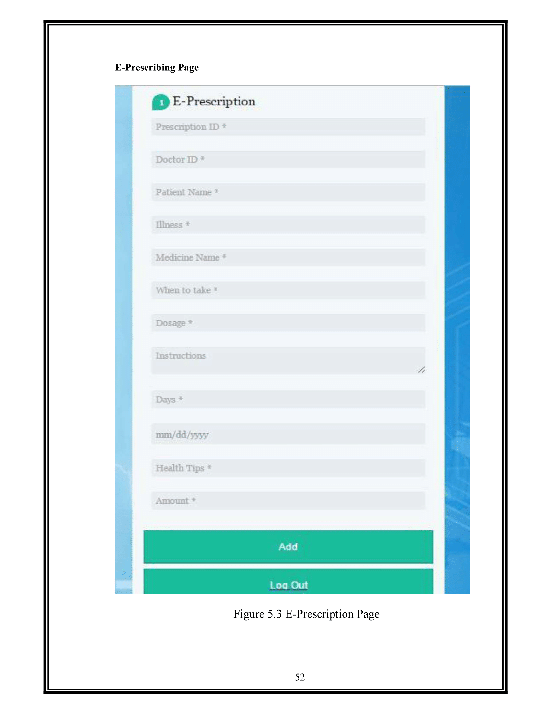
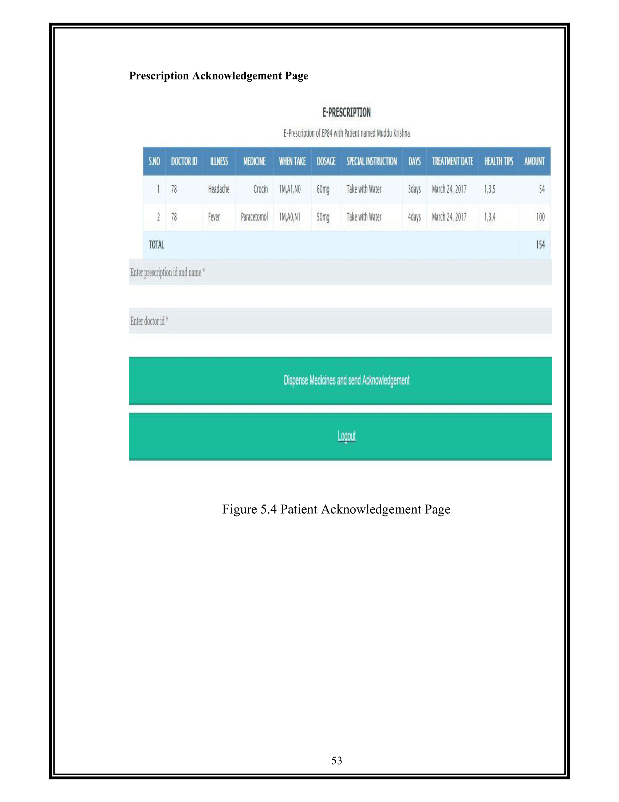
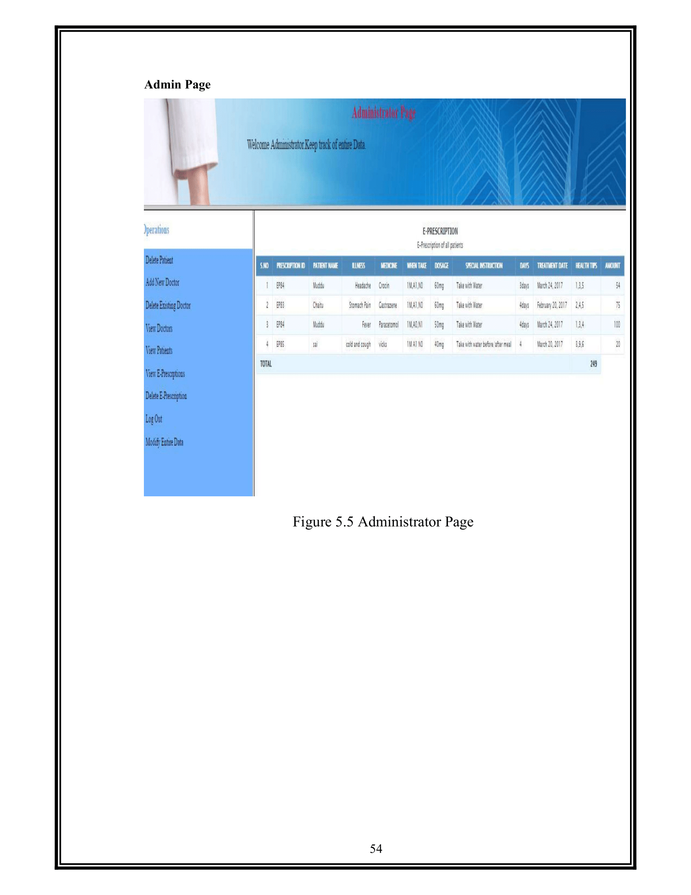

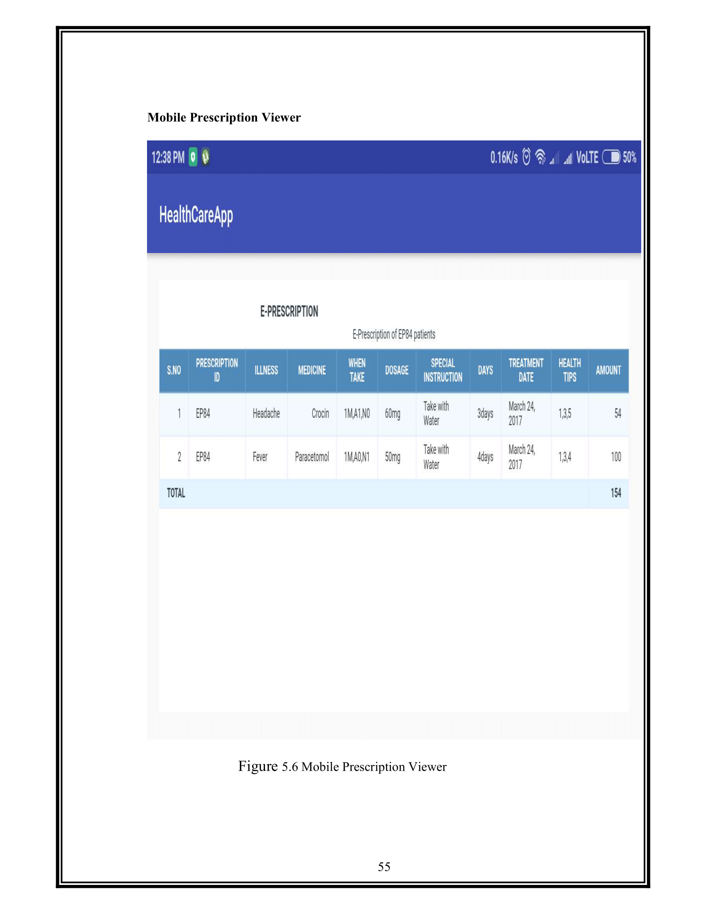
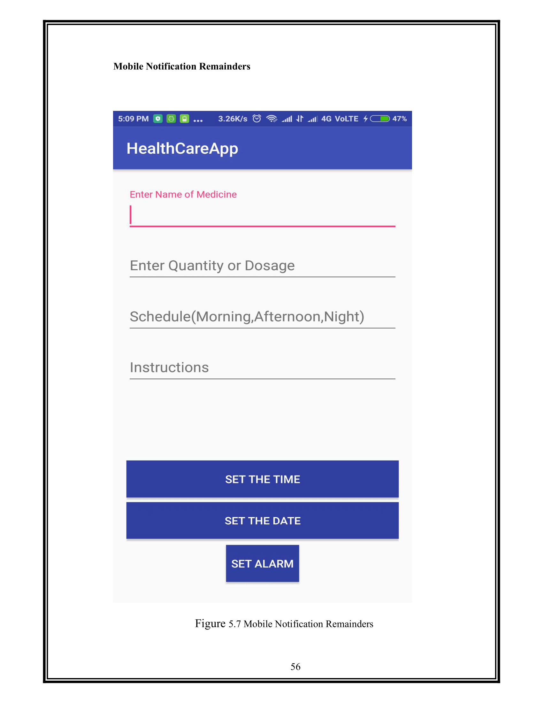
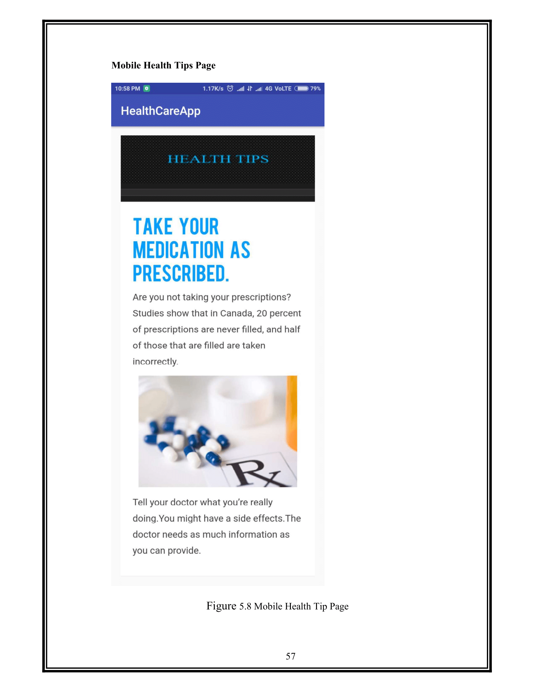
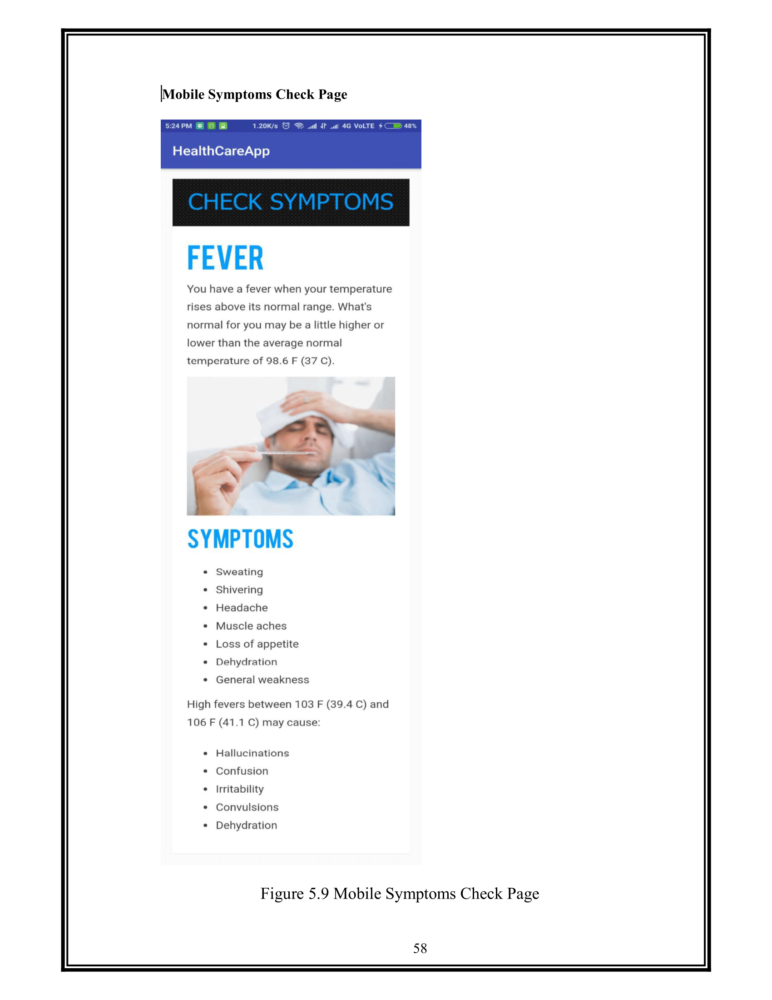
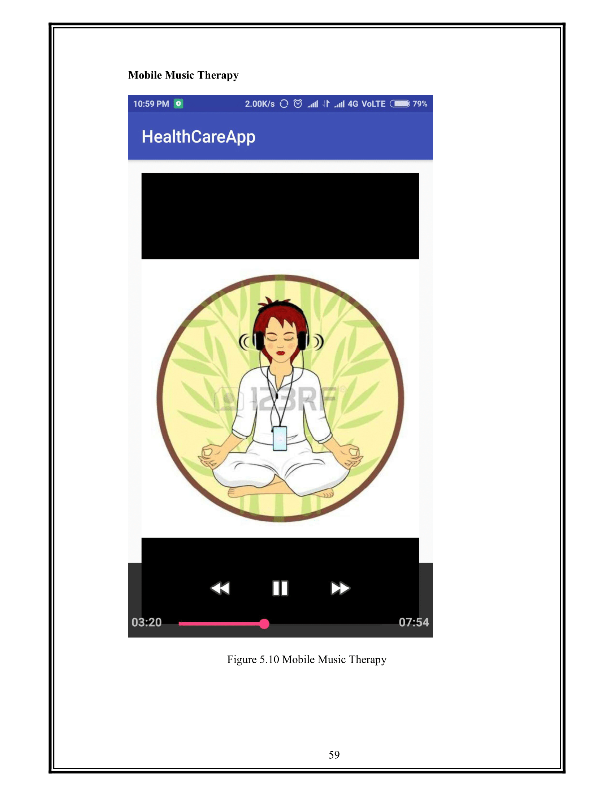

### Project submitted by
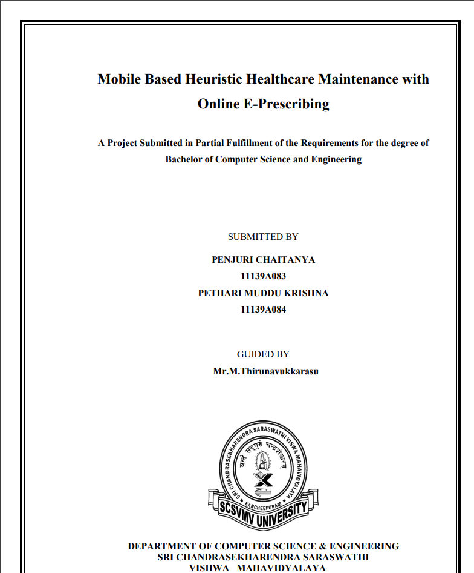

## Authors

Chaitanya Penjuri

Pethari Muddu Krishna Reddy

### IJERT Publish Link

https://www.ijert.org/research/mobile-based-heuristic-healthcare-maintenance-with-online-e-prescribing-IJERTV7IS040134.pdf

## License

This project is licensed under the Apache 2.0 License - see the LICENSE.md file for details
